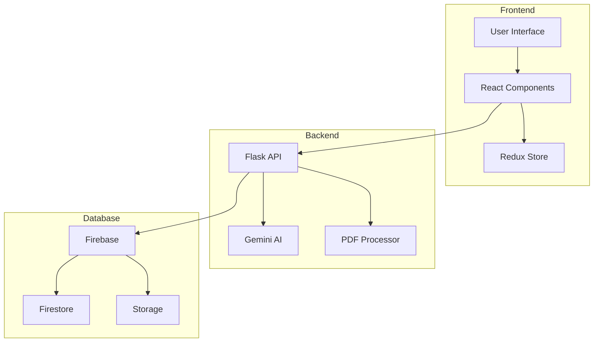
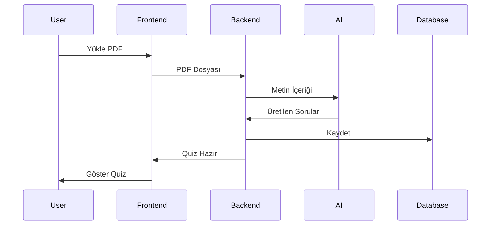
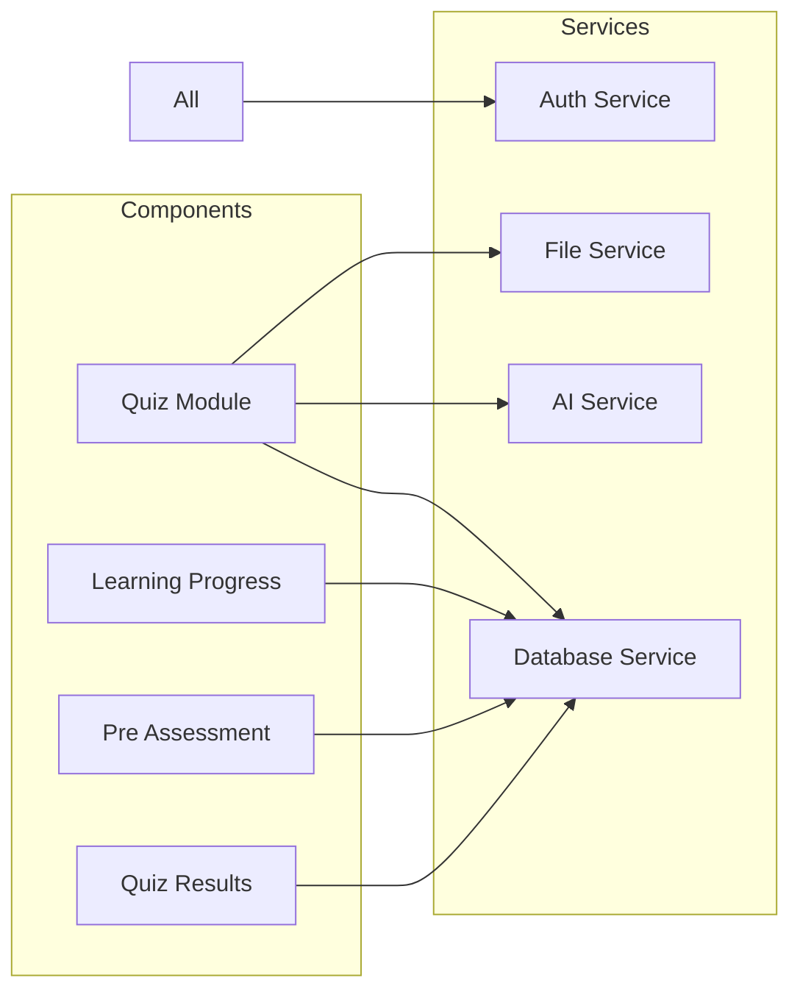
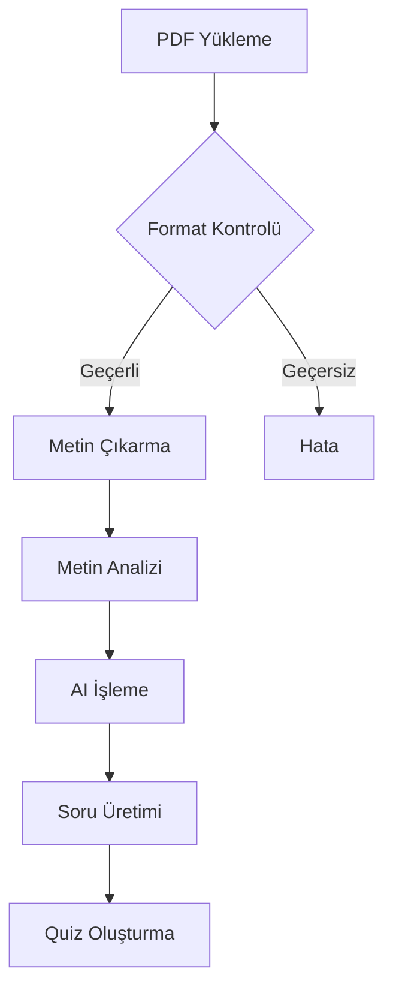
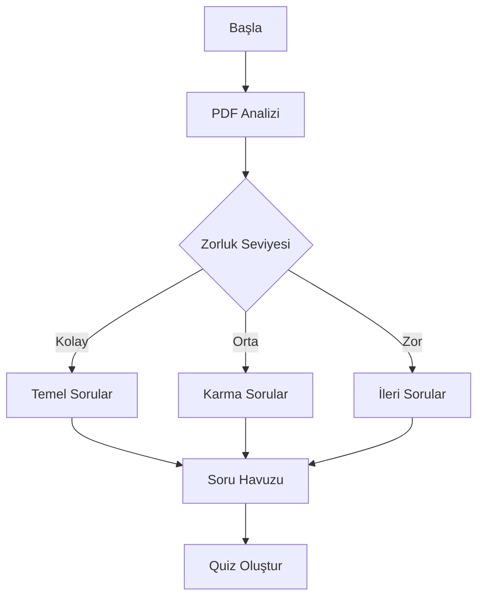
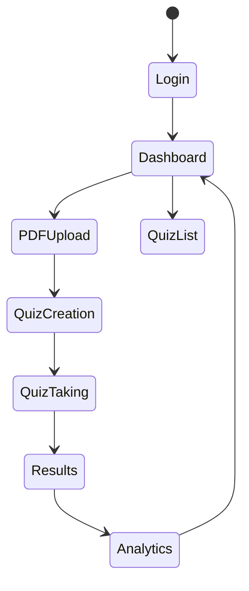
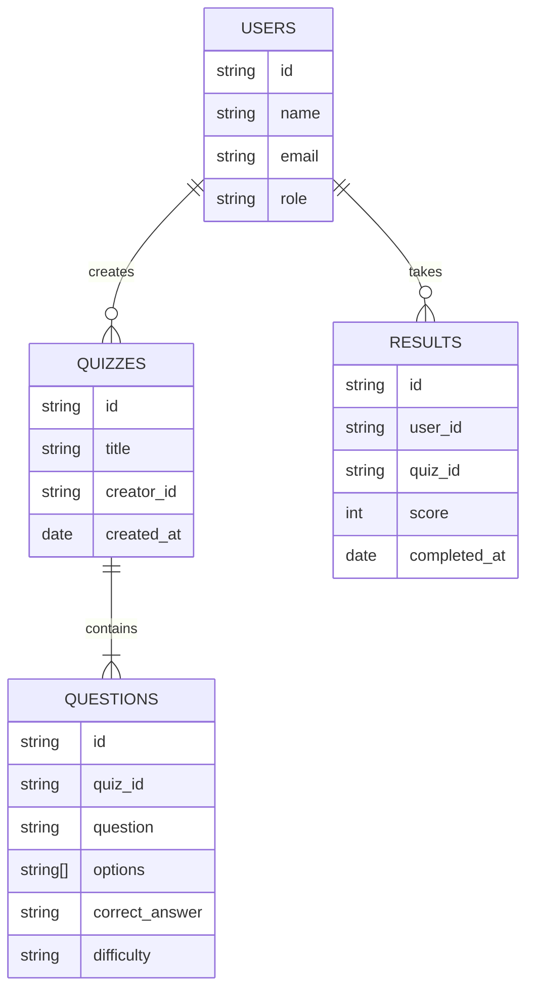
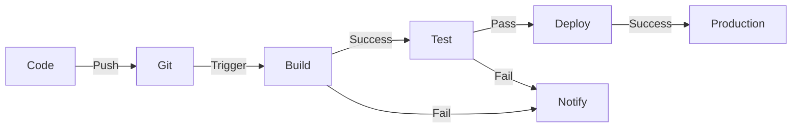
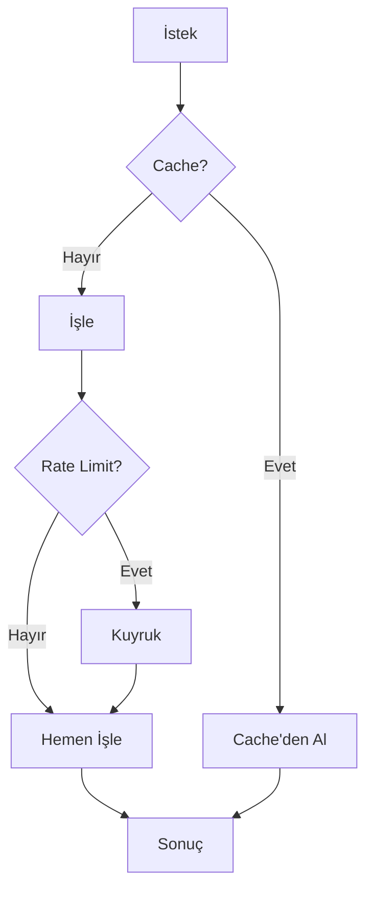
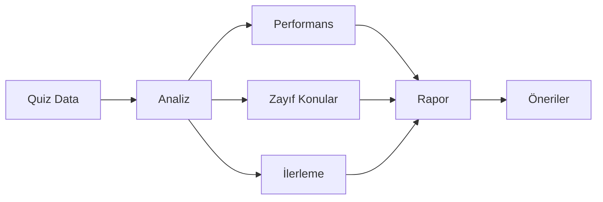

# Sistem Diyagramları

## 1. Sistem Mimarisi

## 2. Veri Akış Şeması

## 3. Bileşen İlişkileri

## 4. PDF İşleme Süreci

## 5. Quiz Oluşturma Algoritması

## 6. Kullanıcı Etkileşim Modeli

## 7. Veritabanı Şeması

## 8. CI/CD Pipeline

## 9. Performans Optimizasyon Akışı

## 10. Öğrenme Analitikleri Süreci

